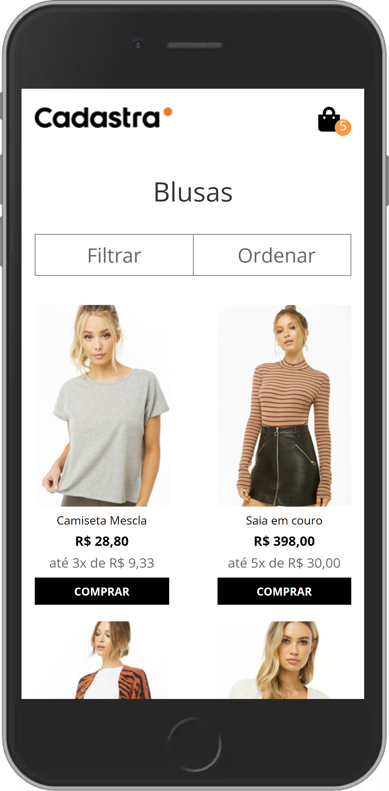

# O projeto 🖥️

<table>
  <tr>
    <td valign="top"></td>
    <td valign="top"></td>
  </tr>
</table>

Para rodar o projeto primeiro é preciso instalar as dependecias usando `npm i` ou `yarn install`. Feito isso basta executar o comando `npm run start` ou `yarn start`

## Features feitas 📋

- Responsividade ✅
- Retorna produtos do banco ✅
- Remove produto do carrinho ✅
- Adiciona produto ao carrinho. ✅
- Funcionalidade: Carregar mais produtos. ✅
- Retorna produtos filtrando por cor, tamanho e preço. ✅
- Filtros salvos na url para que a busca possa ser salva e encaminhada para outra pessoa ✅

### Observações ⚠️

O banco de dados possuia alguns produtos duplicados e foi necessário fazer algumas modificações no arquivo gulp e webpack

##### Dúvidas: [izaacmendes2@gmail.com](mailto:izaacmendes2@gmail.com?subject=processo%20seletivo%20DEV%20-%20Cadastra) [zagamendes@hotmail.com](mailto:zagamendes@hotmail.com?subject=processo%20seletivo%20DEV%20-%20Cadastra)
